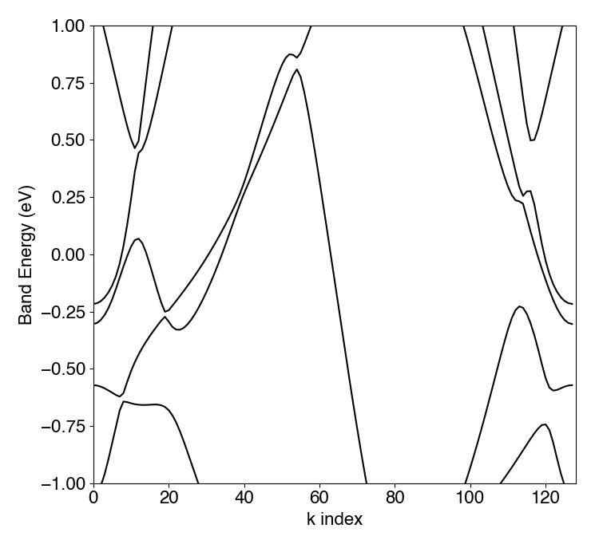
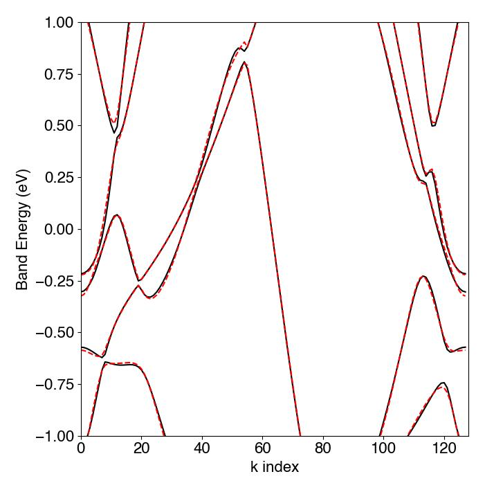

# Learning Solid State Hamiltonians with TensorFlow

A solid, just like any physical system, is governed by a [Hamiltonian](https://en.wikipedia.org/wiki/Hamiltonian_(quantum_mechanics)).  A Hamiltonian is a matrix describing the allowed states of a system and their corresponding energies.  In particular, we can write down a Hamiltonian that describes an electron inside of a solid so that the eigenvalues of this Hamiltonian matrix represent the allowed energies for that electron.  By solving for the eigenvalue spectrum as a function of momentum, we can construct the material's [band structure](https://en.wikipedia.org/wiki/Electronic_band_structure), from which all other material properties can in principle be derived.  

The details of this Hamiltonian (and thus of the electronic structure) depend sensitively on material properties like crystal structure and elemental composition.  Typical band structures can be calculated with sophisticated first principles methods such as density functional theory.  However, it is also often useful to have a simple model represented by a relatively small Hamiltonian matrix.  Such simple tight binding models, as they are called, are usually constructed within the [Slater-Koster formalism](https://journals.aps.org/pr/abstract/10.1103/PhysRev.94.1498), in which the band structure is parameterized by a finite set of matrix elements and these parameters are then fit to first principles calculations using a least squares procedure.  The topic of this post is a variation on that least squares fitting procedure that utilizes technology that has been developed relatively recently ([Ionescu 2015](https://www.cv-foundation.org/openaccess/content_iccv_2015/papers/Ionescu_Matrix_Backpropagation_for_ICCV_2015_paper.pdf)) in the context of backpropagation in deep neural networks.

Of course, if we are given a Hamiltonian, we can calculate the band structure straightfowardly by simply solving a series of eigenvalue problems (one for each momentum).  There is, however, no closed form solution to the inverse problem, which is our problem, that of deducing the Hamiltonian from a precomputed band structure.  Instead, we treat the problem as an optimization task.  We define a loss function as the squared error between the band structure corresponding to our Hamiltonian and the given band structure, and then proceed to search for the Hamiltonian that minimizes this loss.  As is standard, we would like to use some type of gradient descent to guide our search for the optimal Hamiltonian.  The challenge, however, is that computing the loss function requires a series of eigen-decompositions of the Hamiltonian and it is not at all clear how to differentiate through the act of solving for eigenvalues.  Ideally, we would derive an analytical expression for the eigenvalue spectrum and simply differentiate this expression with respect to the Hamiltonian parameters.  This, however becomes rapidly infeasible for matrices larger than a few elements.  In practice, a numerical approximation to the gradient can be used following the [Levenberg-Marquardt algorithm](https://arxiv.org/pdf/1910.02917.pdf).  This algorithm, however, is known to be sensitive to initial conditions and it can take a good deal of care and physical intuition to arrive at an adequate convergence (see [here](https://journals.aps.org/prb/abstract/10.1103/PhysRevB.55.4168), for example, where they initialize the search of parameter space with a simplex algorithm and simulated annealing before iteratively adding parameters to the model).  It would be great if, instead of going through these acrobatics each time we want to perform a least squares fit, we could simply perform the differentiation through matrix calculus.

Enter deep learning.  It turns out that there are a number of machine learning tasks (apart from the problem of learning solid state Hamiltonians) for which eigen-decomposition is a crucial step.  A few examples are image segmentation, feature extraction, descriptor design, structure from motion, camera calibration, dimensionality reduction, and others (list from [Ionescu et al.](https://www.cv-foundation.org/openaccess/content_iccv_2015/papers/Ionescu_Matrix_Backpropagation_for_ICCV_2015_paper.pdf)).  In the standard deep learning approach, the parameters of the network are learned through backpropagation through a computational graph.  Deep learning researchers have therefore devoted significant effort to developing efficient algorithms for propagating gradients through "spectral" layers, or layers that perform an eigen-decomposition.  Tensorflow, for example, implements the method proposed [here](https://www.cv-foundation.org/openaccess/content_iccv_2015/papers/Ionescu_Matrix_Backpropagation_for_ICCV_2015_paper.pdf) (eq. 14).  It is worth noting that this method still has certain instabilities, particularly for cases with [nearly degenerate eigenvalues](https://arxiv.org/abs/1906.09023).  But hey, it seems to work pretty well for band structures (where degeneracies are typically limited to a discrete set of order zero)!  As we will see below, we can utilize this method of backpropagation through a spectral layer to completely circumvent the more traditional Levenberg-Marquardt algorithm and produce excellent least squares fits to precomputed band structures in a matter of minutes.

# An Example

Here we walk through the code contained in tensorHam.py.  We start with a precomputed band structure for a particular material:

```python
import pickle
import matplotlib.pyplot as plt

k_vec = pickle.load(open('.../k_vec.pkl','rb')) #array of momentum vectors along which the bands are computed
evals = pickle.load(open('.../evals.pkl','rb')) #eigenvalues associated with each point in momentum space

for i in range(evals.shape[0]):
	plt.plot(evals[i,:],color='k')
plt.ylim([-1,1])
plt.xlim([0,128])
```



It is perhaps easier to think of this in the langauge of statistical models and function approximation.  We are given a set of *n* functions *f*<sub>n</sub>(*k*) with the property that there exists an *n* x *n* matrix, ***H***, parameterized by independent variable *k*, such that the eigenvalue spectrum of ***H***(*k*) approximates *f*<sub>n</sub>(*k*) for each *k*.  Clearly, we need to initialize the matrix ***H***, compute the eigenvalue spectrum *e*<sub>n</sub>(*k*), formulate a loss function as the squared difference between *e*<sub>n</sub>(*k*) and *f*<sub>n</sub>(*k*), compute gradients of this loss with respect to the elements of ***H***, update the elements of ***H*** with a gradient descent rule, rinse and repeat until the loss is minimized.  One additional detail that is specific to the problem of physical Hamiltonians is that the dependence on *k* must follow a known functional form relating to the change in phase of the quantum mechanical wave function upon hopping from one site of the crystal lattice to another.  We capture this by defining a geometrical structure for the crystal lattice:

```python
orbs = np.array([[0,0],[0,0],[0,0],[0,0],[0,0],[2/3,1/3],[2/3,1/3],[2/3,1/3],[1/3,2/3],[1/3,2/3],[1/3,2/3]])
```

This array representes the atomic orbital positions in a reduced coordinate system.  Momentum dependence enters as a phase proportional to the vector displacement between atomic sites.  We therefore construct an array containing all possible hopping vectors:

```python
Rij = np.zeros((len(orbs),len(orbs),2))
for i in range(len(orbs)):
	for j in range(len(orbs)):
		Rij[i,j,:] = -orbs[i,:] + orbs[j,:]
```

We also allow hoppings to neighboring unit cells.  Here is an array of vectors connecting the home unit cell to neighboring unit cells.

```python
cells = np.array([[0,0],[1,0],[1,1],[0,1],[-1,0],[-1,-1],[0,-1]])
```

The rule for computing element (i,j) of the Hamiltonian matrix is that we add all possible hoppings from orbital i to orbital j, weighted by a phase factor proportional to the momentum times the vector displacement between orbitals i and j.  This will become clear as we construct the Tensorflow model.  The important point is that our model must take as input the geometry of the lattice and output an array of hoppings that are learned by a least squares optimization procedure.  We therefore construct the following custom layer class:

```python  
class GenHam(Layer):
	def __init__(self, Rij, cells):
		super(GenHam, self).__init__()
		#this defines the geometry of the lattice
		self.Rij = Rij[:,:,:]
		self.cells = cells
	
	def build(self,input_shape):
		w_init = tf.random_normal_initializer()
		#self.amp is the array of hoppings that we would like to learn for each orbital i,j and for each cell.
		self.amp = tf.Variable(name='amplitude_matrix', initial_value = w_init(shape = (self.Rij.shape[0],self.Rij.shape[1],int((self.cells.shape[0]+1)/2))), dtype = 'float32', trainable=True)
		#self.Rijvar is a tensor containing information about the lattice for later use
		#if we set trainable to True, then it will attempt to learn the lattice geometry as well
		self.Rijvar = tf.Variable(name='orbitals', initial_value = self.Rij, dtype = 'float32', trainable=False)
	
	def call(self, k):
		k = tf.transpose(k)
		R = tf.stack([self.Rijvar for _ in range(self.cells.shape[0])],axis=2) + self.cells
		
		#hoppings must be symmetric
		A0 = self.amp[:,:,0] + tf.transpose(self.amp[:,:,0])
		A1 = self.amp[:,:,1]
		A2 = self.amp[:,:,2]
		A3 = self.amp[:,:,3]
		A4 = tf.transpose(A1)
		A5 = tf.transpose(A2)
		A6 = tf.transpose(A3)
		A = tf.stack([A0,A1,A2,A3,A4,A5,A6],axis=2)

		tmp = tf.cast(tf.squeeze(tf.matmul(R,k)),'complex64')
		phase_mat = tf.exp(2*1j*np.pi*tmp)
		ham = tf.reduce_sum(tf.multiply(tf.cast(A,'complex64'),phase_mat),axis=-1)
		e,v  = tf.linalg.eig(ham)

		return tf.experimental.numpy.take(e,tf.argsort(tf.math.real(e)))
```

This layer takes as input to its constructor information about the geometric structure of the lattice contained in the arrays `Rij` and `cells`.  It then randomly initializes learnable hopping amplitudes in the tensor `amps`.  The call method takes a single argument, `k`, representing a vector in momentum space, formulates the Hamiltonian using information about the geometric structure, and outputs the eigenvalue spectrum for that given momentum.  

Note that for a physically realistic model, we would have to do a bit more work to restrict hoppings to nearest or next nearest neighbors and enforce the symmetries of the relevant atomic orbitals.  While this is perfectly doable within the present framework, it would introduce considerable complexity in the code.  For this demonstration, we stick to the basics.

Now we need a custom loss function to compare the eigenvalue spectrum produced by our model to the true eigenvalue spectrum obtained from first principles calculations.

```python
class LeastSquares(Loss):
	def __init__(self):
		super().__init__()

	#expect y_true and y_pred to be (numOrbs,) eigenvalues for a given k point
	def call(self, y_true, y_pred):
		mask = tf.cast(tf.abs(y_true)<=1.5,'float32')
		e_real = tf.math.real(y_pred)
		e_imag = tf.math.imag(y_pred)

		squared_error = tf.reduce_sum(tf.multiply(tf.math.pow(tf.abs(e_real - y_true),2),mask))
		
		loss = 1.5*squared_error + tf.reduce_sum(tf.square(e_imag))
		
		return loss
```

There are a few things going on here.  First, we have introduced a mask whose purpose is to set to zero any contribution to the loss coming from true eigenvalues greater than or equal to 1.5 eV in magnitude.  The idea behind this is that we are only attempting to fit the band structure within a +/- 1.5 eV window around the Fermi level (i.e. around zero energy).  This is necessary: since our simplified tight binding model is drastically reducing the number of atomic orbitals, we better expect to only be able to fit a few of the energy bands.  We then contrusct a masked squared error given by the difference between our predicted eigenvalue spectrum and the true eigenvalue spectrum.  Finally, since there is no explicit enforcement of hermiticity in the layer class, we include a term in the loss proportional to the imaginary part of the eigenvalues.  This will push the learned Hamiltonian towards having real eigenvalues, which is necessary for any physical system.

We are finally ready to train this model. 

```python
model = tf.keras.Sequential([GenHam(Rij, cells)]) 
opt = tf.keras.optimizers.SGD(learning_rate=5e-3)
model.compile(optimizer=opt, loss=LeastSquares())

model.fit(k_vec,evals.T,epochs=50,batch_size=1)
```
The fit is completed in under a minute on a seven year old MacBook pro with on the order of 100 browser tabs open (!).  Here is the result:

```python
evals_model = np.zeros(evals.shape)
for i in range(len(k_vec)):
	e = tf.math.real(model(np.array([[k_vec[i,0],k_vec[i,1]]]))).numpy()
	evals_model[:,i] = e

for i in range(evals.shape[0]):
	plt.plot(evals[i,:],color='k')
	plt.plot(evals_model[i,:],color='r',linestyle='--')
plt.ylim([-1,1])
plt.xlim([0,128])
```




To recap, at this point we have succeeded in taking a complex electronic structure model that was computed on a supercomputer using sophisticated theoretical techniques, and reducing it to an 11 x 11 matrix eigenvalue problem that can be solved in about 1.5 seconds on your average laptop.  Not too shabby!  Of course, the real usefulness in doing something like this is to be able to then go in and analyze the hoppings in order to gain physical insight into the electronic structure.  Thankfully, this information is now stored in the learned model parameters.  One convenient way to organize this information for further analysis is to load it into a tight binding model using the [pythtb](http://www.physics.rutgers.edu/pythtb/) package.

```python
from pythtb import *

R = model.weights[1].numpy()
orb = (R[0,:,:]).tolist() #the orbital positions

amps = model.weights[0].numpy() #the hopping amplitudes
amps[:,:,0] = amps[:,:,0] + amps[:,:,0].T #symmetrize the R=0 hoppings (as in the layer call function)

my_model=tb_model(2,2,lat,orb) #create the pythtb model

my_model.set_onsite(np.diag(amps[:,:,0]).tolist()) #assign the onsite energies

#fill in the off-diagonal hoppings
for i in range(amps.shape[0]):
	for j in range(amps.shape[1]):
		for k in range(amps.shape[2]):
			if k==0:
				if i > j:
					my_model.set_hop(amps[i,j,k],i,j,(cells[k,:]).tolist(),allow_conjugate_pair=False)
			else:
				my_model.set_hop(amps[i,j,k],i,j,(cells[k,:]).tolist(),allow_conjugate_pair=False)
```

The model is now stored in the object my_model and can be inspected and explored as for any other tight binding model.

See the code files for more comments and implementation details.


